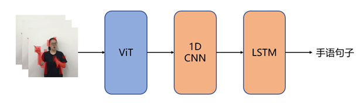
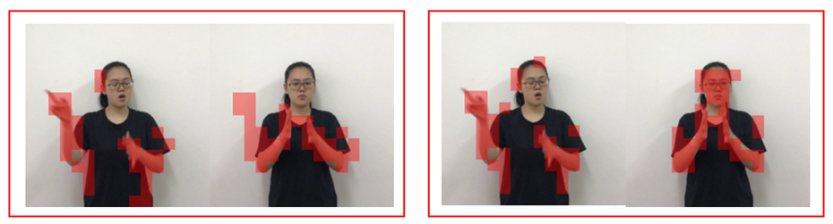
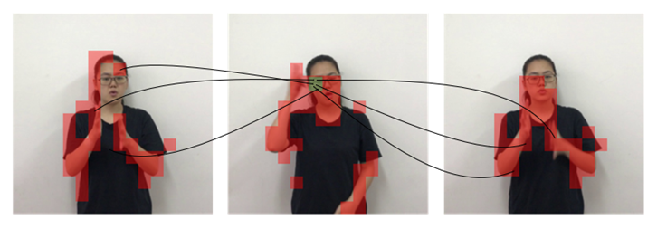

# TLG-CSLR
Using Transformer, LSTM and Graph Attention for CSLR

<div align="center">
<h1>TLG-CSLR </h1>
<h3>Using Transformer, LSTM and Graph Attention for CSLR</h3>
</div>

## Method

**The overall architecture of the continuous sign language recognition model adopts a joint framework combining Vision Transformer (ViT) and Bi-directional Long Short-Term Memory (BiLSTM).**

<p align="center">
  
</p>

**Since continuous sign language recognition requires parallel processing of hundreds of frames, it introduces substantial computational latency. To mitigate this issue, we reduce the scale of input data. Drawing on the frame differencing strategy, we select salient regions from sign language videos and optimize this process to filter out background areas.**

<p align="center">
  
</p>

**We adopt Adapter and Prefix-Tuning fine-tuning strategies to accelerate the training procedure. To strengthen the capability of temporal information modeling, an adaptive graph attention module is inserted between attention layers.**

<p align="center">
  
</p>

## Getting Started

### Installation

**Step 1: Environment Setup:**

```bash
conda create -n TLG_CSLR
conda activate TLG_CSLR
```

We recommend using the pytorch<2.0, Linux.


### Model Training and Inference

Data preparation: Dataset with the following folder structure.

```
│Dataset/
├──videos
│  ├──train/
│  │   ├── 000011
│  │   │   ├── 00001.JPG
│  │   │   ├── 00002.JPG
│  │   │   ├── ......
│  │   ├── ......
│  ├──test/
│  │   ├── 000045
│  │   │   ├── 00001.JPG
│  │   │   ├── 00002.JPG
│  │   │   ├── ......
│  │   ├── ......
├──keypoints
│  ├── 000011.npy
│  ├── 000045.npy
│  ├── ......
```

**Train:**
```bash
python train.py
```

**Inference:**
```bash
python prediction.py
```

## Acknowledgment

This project is built upon the following open-source works:

- **AdaptSign**：  Improving Continuous Sign Language Recognition with Adapted Image Models. ([paper](https://arxiv.org/abs/2404.08226), Code available at [code](https://github.com/hulianyuyy/AdaptSign)), We used the model architecture and training pipeline from this repository.


We thank the authors for their contributions and open-sourcing these valuable tools.

